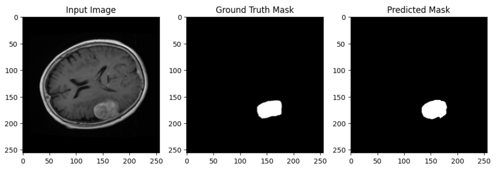

# UNETR2D: A custom implementation for 2D Medical Image Segmentation

## Overview

UNETR2D is a custom implementation of the UNETR architecture, adapted for 2D medical image segmentation tasks. This project is specifically designed for brain tumour segmentation using MRI images. The model leverages the Vision Transformer (ViT) for encoding, followed by a UNet-like decoder structure. The architecture is highly modular and configurable, making it suitable for production environments.

## Introduction

Medical image segmentation is a crucial task in the diagnosis and treatment planning of various diseases, including brain tumours. This project implements a state-of-the-art segmentation model, UNETR2D, which combines the strengths of the Vision Transformer and the traditional UNet architecture to achieve high performance on 2D medical images.

## Architecture

The architecture of UNETR2D consists of two main components:

1. **Encoder (Vision Transformer)**: The encoder uses a Vision Transformer (ViT) to process the input images. The images are first split into patches, which are then embedded and passed through multiple Transformer layers. This allows the model to capture global contextual information effectively.

2. **Decoder (UNet-like Structure)**: The decoder follows a UNet-like structure with a series of up-sampling layers and skip connections from the encoder. This design helps in reconstructing the fine details of the segmentation masks.

### Architecture

The architecture can be summarised as follows:

- **Input**: A 2D image of shape `(H, W, C)`, where `H` and `W` are the height and width, and `C` is the number of channels.
- **Patch Embedding**: The input image is divided into non-overlapping patches of size `(P, P)` and flattened.
  
  Patch Embedding = Linear(Flatten(Patches))

- **Transformer Encoder**: The patch embeddings are passed through multiple Transformer encoder layers. Each layer consists of multi-head self-attention followed by a feedforward neural network.

  Output_Transformer = MultiHeadSelfAttention(Input) + MLP(Normalisation(Output))

- **Skip Connections**: Skip connections are used to transfer feature maps from the encoder to the corresponding decoder layers, enhancing the model's ability to retain spatial information.

- **Decoder**: The decoder comprises a series of up-sampling layers that progressively restore the original image resolution. Each decoder block combines feature maps from the encoder through concatenation.

  UpSampling(Decoder Layer) + Skip Connection = ConvBlock(Concatenation)

- **Output**: The final output is a segmentation map of the same spatial dimensions as the input image, with a single channel representing the tumour mask.

## Dataset preparation

### Preprocessing

The dataset used for training consists of MRI images of the brain along with their corresponding tumour masks. The raw data is stored in `.mat` files, which are preprocessed to generate PNG images and masks.

```python
from preprocess.raw_brain_tumour_preprocess import process_mat_files_parallel

input_dirs = ['path/to/mat/files']
output_image_dir = 'path/to/output/images'
output_mask_dir = 'path/to/output/masks'

process_mat_files_parallel(input_dirs, output_image_dir, output_mask_dir, num_workers=4)
```

This script processes the .mat files in parallel, extracting the image and tumour mask, normalising them, and saving them as grayscale PNG files.

### Dataset class
The dataset is loaded using a custom BrainTumorDataset class, which is designed to handle the images and masks efficiently.

## Training

### Configuration
The training process is controlled via a YAML configuration file, which is parsed into a Python dataclass. This setup allows for easy adjustments and integration into production pipelines.

### Training script

The training process involves the following steps:

- Data loading: The dataset is split into training, validation, and test sets.

- Model initialisation: The UNETR2D model is initialised with the configuration parameters.

- Training loop: The model is trained using Binary Cross-Entropy with logits loss, optimised with Adam.

- Validation: The model is validated at the end of each epoch to monitor performance and avoid overfitting.

- Checkpointing: The best model is saved based on the lowest validation loss.

## Results

Detailed results and model checkpoints are stored in the specified directories.

### Example Result

#### Image 5


#### Image 50


#### Image 500


#### Image 1200


#### Image 2000


#### Image 3000


## Conclusion
UNETR2D provides a robust and scalable solution for 2D medical image segmentation tasks. Its modular design, combined with the power of Transformers and UNet-like decoding, makes it well-suited for production environments where accuracy and reliability are paramount.

## References

1. **Hatamizadeh et al.** *UNETR: Transformers for 3D Medical Image Segmentation.* [https://arxiv.org/abs/2103.10504](https://arxiv.org/abs/2103.10504)
2. **Dosovitskiy et al.** *An Image is Worth 16x16 Words: Transformers for Image Recognition at Scale.* [https://arxiv.org/abs/2010.11929](https://arxiv.org/abs/2010.11929)
